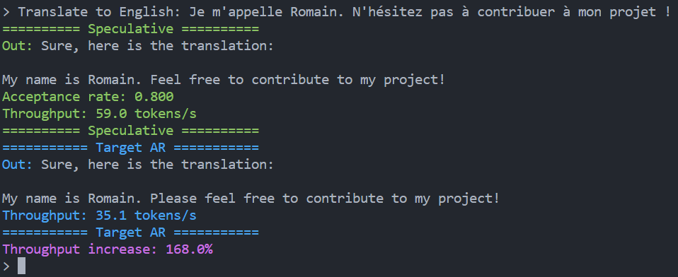
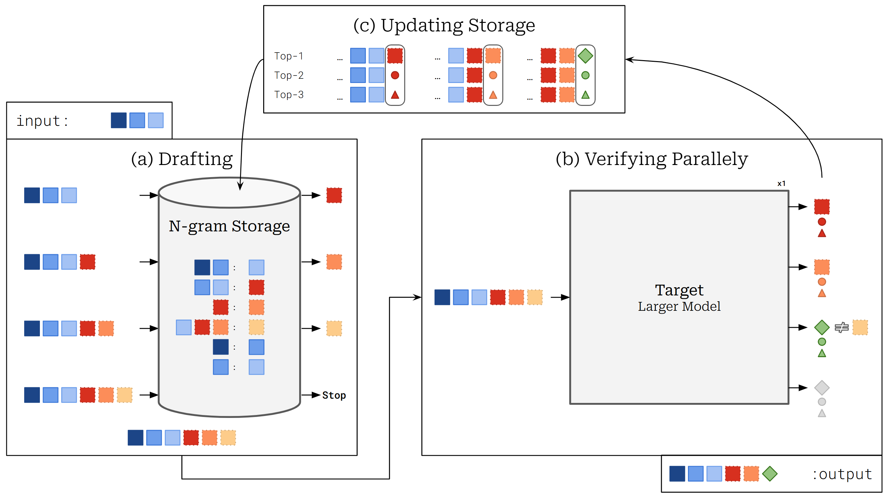

# Speculative Decoding

This repository is a pytorch implementation of Speculative Decoding / Speculative Sampling ([Leviathan et al., 2023](#1); [Chen et al., 2023](#2)).
It contains the code for three generation strategies: classic auto-regressive decoding, beam search decoding (with length penalty) and speculative decoding. Auto-regressive decoding and Speculative Decoding can be used in a greedy or nucleus sampling (temperature, top k and top p) setting.

<p align="center">
    
    <br>
    <em>Figure 1: Example of generation, comparing Speculative Decoding and Vanilla Decoding. The difference of text is due to the pseudo-random estimation of computers.</em>
</p>

## What is Speculative Decoding?

Speculative Decoding is a decoding strategy for transformers that allows to generate sequences faster than the classic auto-regressive decoding without changing the output distribution or requiring further fine-tuning. It uses a smaller, more efficient approximation model (called a "drafter") to generate speculative token prefixes. These prefixes are then evaluated in parallel by the larger target model, reducing the number of serial decoding steps required and leading to inference speedups.

The core process rely on the specific behavior of the Transformer model that allows to compute the probability distribution of all the fed in tokens. This distribution is then used to verify the drafts generated by the drafter model.

<p align="center">
    
    <br>
    <em>Figure 2: Overview of Speculative Decoding.</em>
</p>

## How to use

### 0. Installation
This project requires Python 3.7 or later and the following dependencies:

```
rich
tqdm
termcolor
tokenizers>=0.19.1
torch>=2.3.0
transformers>=4.41.1
accelerate>=0.30.1
bitsandbytes>=0.43.1
```

Simply fork this repository and install the dependencies.

### 1. Generate text using Speculative Decoding

#### a. Load the target and drafter model

The target model is the transformer model we want to accelerate, while the drafter model is the smaller model that will be used to generate drafts to the target model.

Here are some requirements to make speculative decoding work:
- The target model must be a transformer model (decoder only or encoder-decoder).
- The drafter model must share the same tokenizer as the target model.
- The target model and the drafter model should output same shape logits.
- The target model should be large enough to benefit from the acceleration. (causing a bottleneck in memory)
- The drafter model should be small enough to be faster than the target model.

```python
from transformers import AutoTokenizer, AutoModelForCausalLM

# We will use the Google Llama-3.2 3B Instruct as the model we want to accelerate (3B parameters)
target_model_name = "meta-llama/Llama-3.2-3B-Instruct"
target = AutoModelForCausalLM.from_pretrained(target_model_name)

# We will use the Google Llama-3.2 1B Instruct as the drafter model (1B parameters)
drafter_model_name = "meta-llama/Llama-3.2-1B-Instruct"
drafter = AutoModelForCausalLM.from_pretrained(drafter_model_name)

# Don't forget to load the tokenizer
tokenizer = AutoTokenizer.from_pretrained(target_model_name)
```

#### b. Prepare the input

Before generating text, we need to prepare the input. The input should be tokenized and encoded using the tokenizer.

```python
prefix = "Translate to English: Je m'appelle Romain. N'hésitez pas à contribuer à mon projet !"

chat_templated = f"<bos><start_of_turn>user\n{prefix}<end_of_turn>\n<start_of_turn>model\n" # Gemma chat template
input_ids = tokenizer(chat_templated, return_tensors="pt").input_ids
input_ids = input_ids[0].tolist() # Generation methods require a list of ids
```

#### c. Generate text

Speculative Decoding uses one hyperparameter: $\gamma$, the number of drafts generated by the drafter model at each step. 

Increasing the value of $\gamma$ will not always lead to a faster generation, as the drafts may be rejected more. The acceptance rate $\alpha$ is the number of drafts accepted by the target model divided by the number of drafts generated. The higher the acceptance rate, the faster the generation. So the idea is to find the ideal $\gamma$ according to the acceptance rate in order to get the fastest generation.

```python
from sampling import speculative_generate, autoregressive_generate
# from sampling import speculative_generate_encoder_decoder, autoregressive_generate_encoder_decoder
from utils.logits_processors import NucleusProcessor

# Parameters
gen_len = 100       # Maximum number of tokens generated (could over pass when using speculative decoding)
gamma = 4           # Number of drafts generated by the drafter model at each step
logits_processor = NucleusProcessor(temperature=.6, top_p=.9) # Nucleus sampling with p=0.9 and T=0.6

# Generate text using the classic auto-regressive decoding (slow)
output_ids_ar = autoregressive_generate( # or autoregressive_generate_encoder_decoder for encoder-decoder models
                input_ids,
                target,
                logits_processor=logits_processor,
                max_gen_len=gen_len,
                end_tokens_id=tokenizer.eos_token_id,
                pad_token_id=tokenizer.pad_token_id,
            )
output_ar = tokenizer.decode(output_ids_ar, skip_special_tokens=True)

# Generate text using the speculative decoding (faster)
output_ids_sd, alpha = speculative_generate( # or speculative_generate_encoder_decoder for encoder-decoder models
                input_ids,
                drafter,
                target,
                logits_processor=logits_processor,
                gamma=gamma,
                max_gen_len=gen_len,
                end_tokens_id=tokenizer.eos_token_id,
                pad_token_id=tokenizer.pad_token_id,
            )
output_sd = tokenizer.decode(output_ids_sd, skip_special_tokens=True)

print("Auto-regressive decoding:", output_ar)
print("Speculative decoding:", output_sd)
print("Acceptance rate:", alpha) # Number of drafts accepted by the target model divided by the number of drafts generated
```

To use Beam Search Decoding, you can use the `beam_search_generate` function. The `beam_search_generate` function requires `top_k` (number of tokens to evaluate at each branch), `num_beams` (number of beams that run in parallel), `min_length` and `alpha` (for length penalty) hyperparameters.

```python
from sampling import beam_search_generate # Beam Search Decoding is not compatible with encoder-decoder models yet.

output_ids_bs = beam_search_generate(
                input_ids,
                target,
                max_gen_len=gen_len,
                end_tokens_id=tokenizer.eos_token_id,
                pad_token_id=tokenizer.pad_token_id,
                top_k=3,
                num_beams=5,
                min_length=5,
                alpha=1.2,
            )
```

### 2. Run console interface Inference

You can run `infer.py` in your console to generate text using the console interface. You can easily change the hyperparameters of the generation, compare target and speculative generation, enable drafter generation and much more.

```bash
python infer.py
```

To change the models used, you can change the `target_model_name` and `drafter_model_name` in the `infer.py` file.
Be careful to change the generate methods to encoder-decoder models if you are using encoder-decoder models.

## Additional content: Ngram Assisted Speculative Decoding 

On top of this implementation, one of the works of my MSc thesis is implemented: **Ngram Assisted Speculative Decoding** (NASD). NASD replaces the drafter model of Speculative Decoding with an $N$-Gram Storage. The $N$-Gram Storage is a count of $k$-grams with $k \in [2, N]$. This storage takes an $N-1$ tokens context and returns the most probable next token from the highest seen $k$-gram, and `None` if the context has never been seen.
Before generation, the $N$-Gram Storage is filled with all the $k$-grams of the prompt. During generation, the $N$-Gram Storage is used to generate drafts and updated with the accepted drafts and the target model's predictions.

The advantage of NASD is that it allows for faster generation without the need for a second model. It is training-free and task- and model-agnostic, making it a versatile approach for accelerating sequence generation in transformers.

As I did not published this work, a similar approach as been introduced later in NAPD ([Ou et al., 2024](#3)).
To reproduce their results, you can use the NASD implementation by simply setting `top_k_filler=1`.

*The documentation of NASD will be published soon...*

<p align="center">
    
    <br>
    <em>Figure 3: Overview of NASD method.</em>
</p>

## Known issues
### Cache feature
The cache feature is very inconsistent and sometimes incorrectly implemented in huggingface transformers (mainly depending on the model). This can lead to incorrect results or even errors when using the cache feature. To avoid this issue, you can disable the cache feature by setting `use_cache=False` in the generate methods. This will slow down the generation but will avoid any cache-related issues.

## Did you find any bug?

Please open an issue or submit a pull request if you find any bug. Contributions are welcome!

## References
<a id="1">[1]</a> Leviathan, Y., Kalman, M. &amp; Matias, Y.. (2023). Fast Inference from Transformers via Speculative Decoding. <i>Proceedings of the 40th International Conference on Machine Learning</i>, in <i>Proceedings of Machine Learning Research</i> 202:19274-19286 Available from https://proceedings.mlr.press/v202/leviathan23a.html.

<a id="2">[2]</a> Chen, C., Borgeaud, S., Irving, G., Lespiau, J. B., Sifre, L., & Jumper, J. (2023). Accelerating large language model decoding with speculative sampling. arXiv preprint arXiv:2302.01318. 

<a id="3">[3]</a> Jie Ou, Yueming Chen, Wenhong Tian. (2024). Lossless Acceleration of Large Language Model via Adaptive N-gram Parallel Decoding. <i>Proceedings of the 2024 Conference of the North American Chapter of the Association for Computational Linguistics: Human Language Technologies (Volume 6: Industry Track), pages 10–22</i>